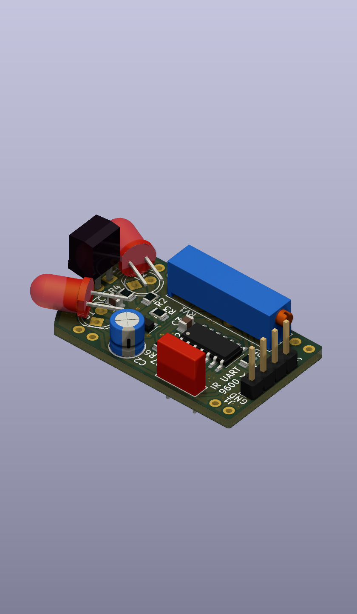
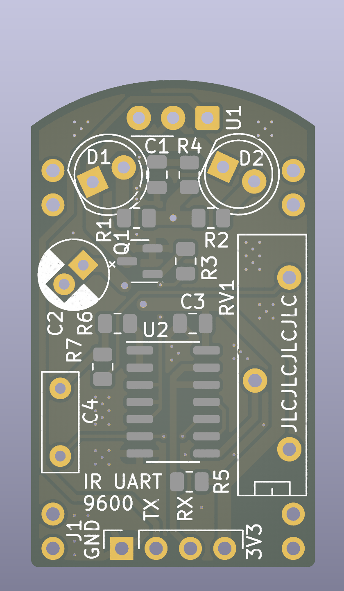

# IR UART

This is an IR UART adapter based on [TSDP34156](http://www.vishay.com/docs/82667/tsdp341.pdf) IR receiver. Its nominal transmission rate is 9600 baud.

The transmitter is built using [TSAL6400](https://www.vishay.com/docs/81011/tsal6400.pdf) 940 nm IR LEDs and a carrier generator based on [74HC132](https://assets.nexperia.com/documents/data-sheet/74HC_HCT132.pdf) quad-NAND CMOS gate.

The adapter can be powered from 3.3 V or 5 V and will operate with the corresponding logic levels.

| · | · |
| - | - |
|  |  |
|  |  |

